# PC-parts-calculator
> Basic app to plan your new desktop PC. Enter, parts, prices, compare categories.
> App saves your data in browser LocalStorage, so you are safe to go away from planing :)
> Live demo [_here_](https://pc-parts-calculator.vercel.app/)

## Table of Contents
* [General Info](#general-information)
* [Technologies Used](#technologies-used)
* [Screenshots](#screenshots)
* [Setup](#setup)
* [Project Status](#project-status)
* [Room for Improvement](#room-for-improvement)
* [Contact](#contact)

## General Information
- Project created as part of recruitment process and for learning purposes.

## Technologies Used
- React
- React Router
- React Context
- Joi
- HTML
- SCSS
- JavaScript

## Screenshots

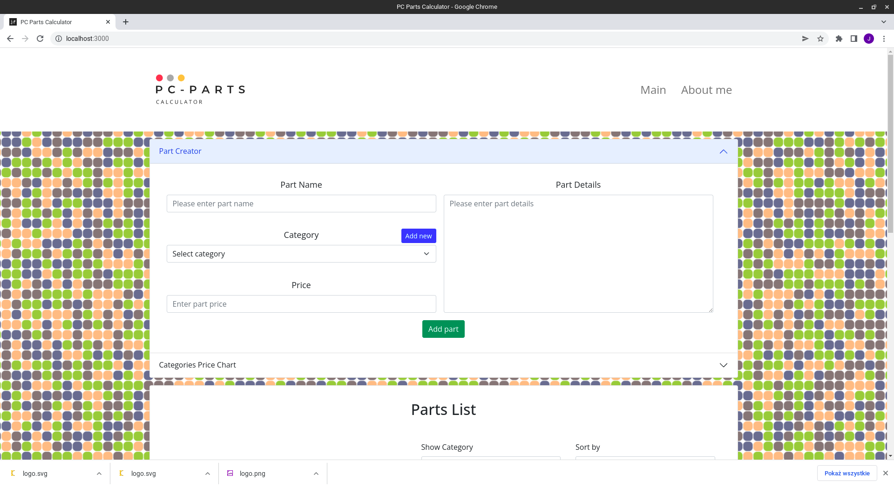
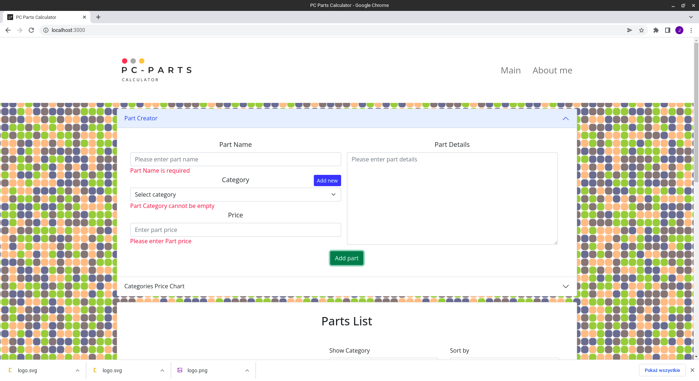
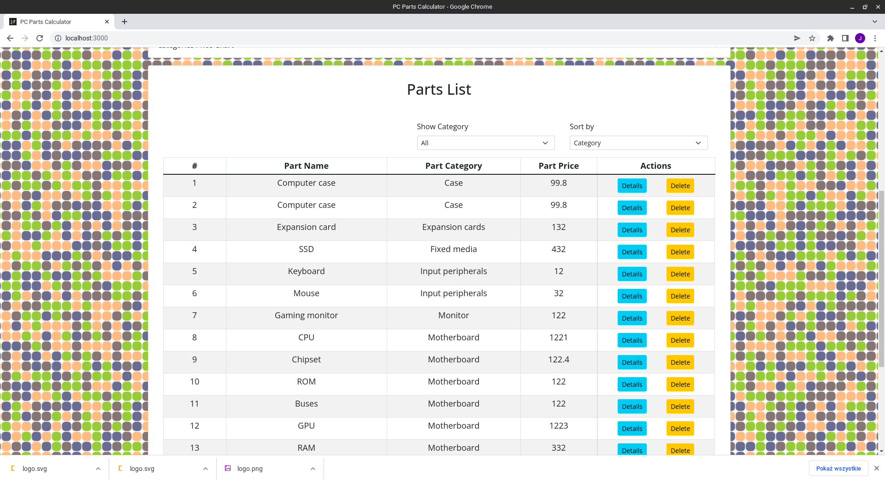
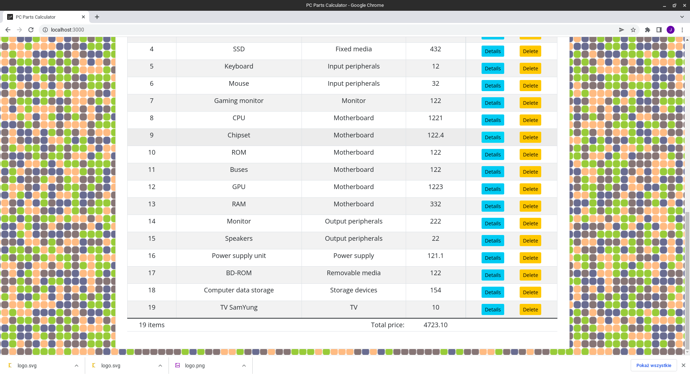
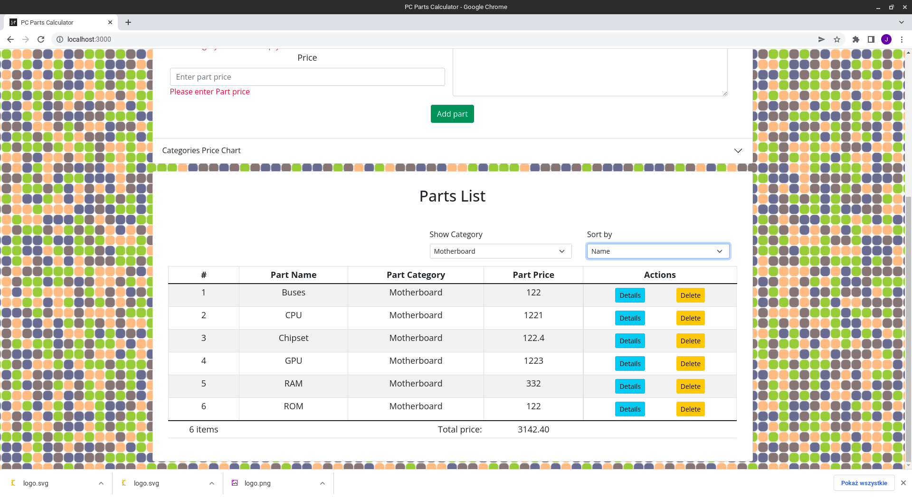
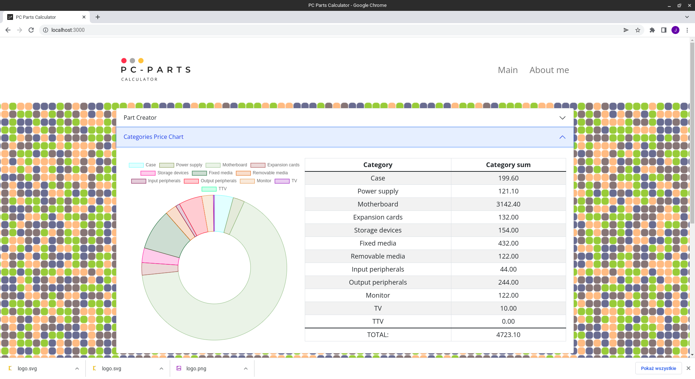
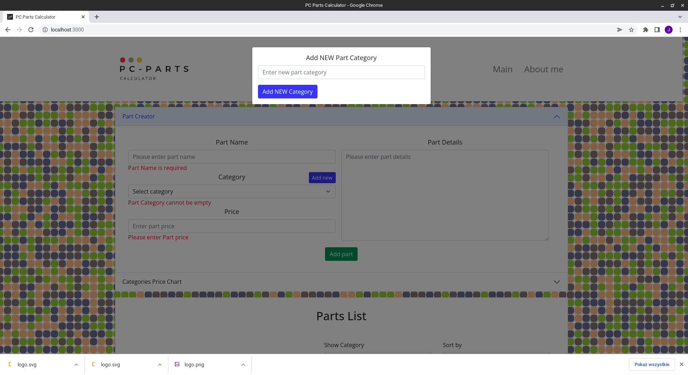
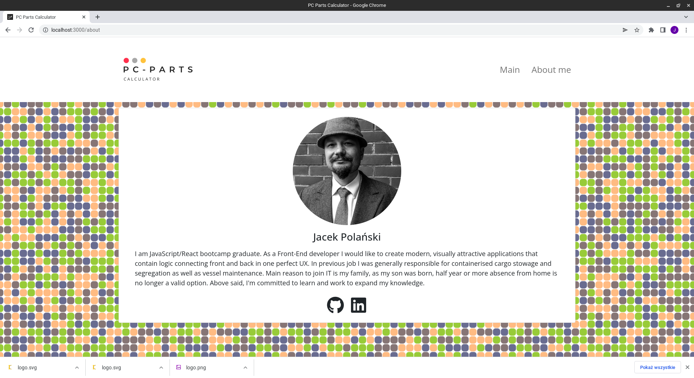
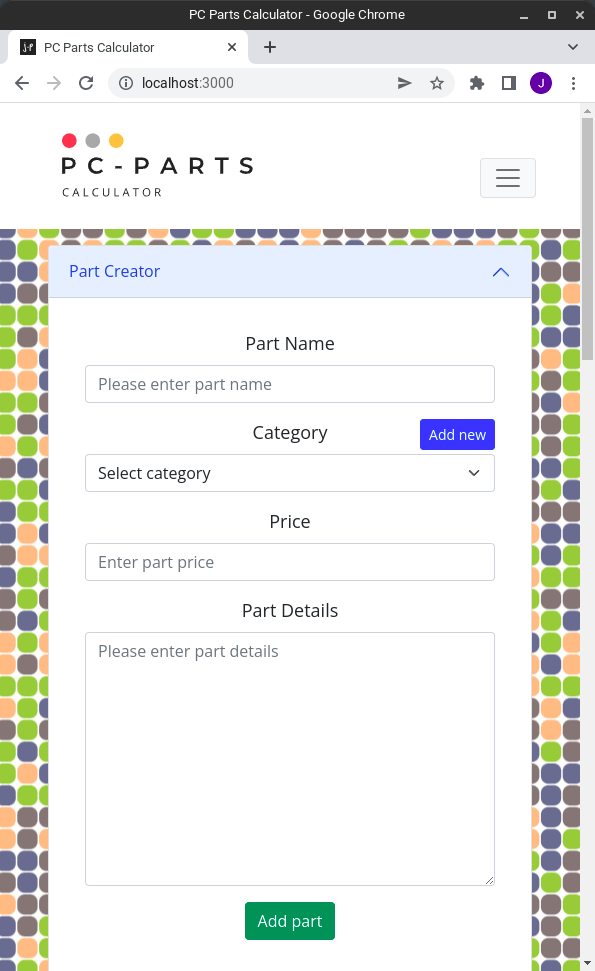
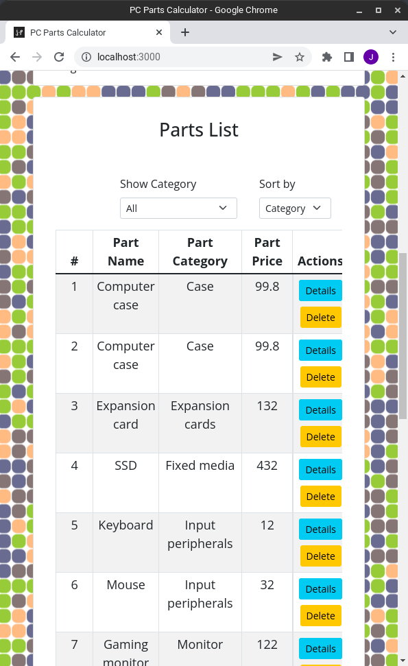
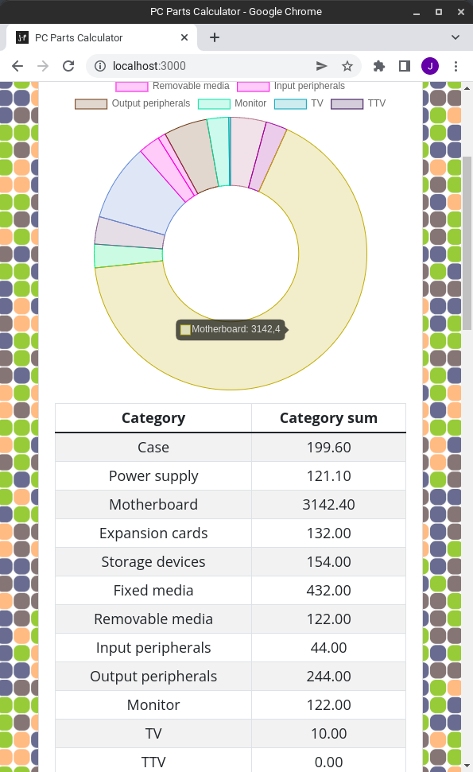
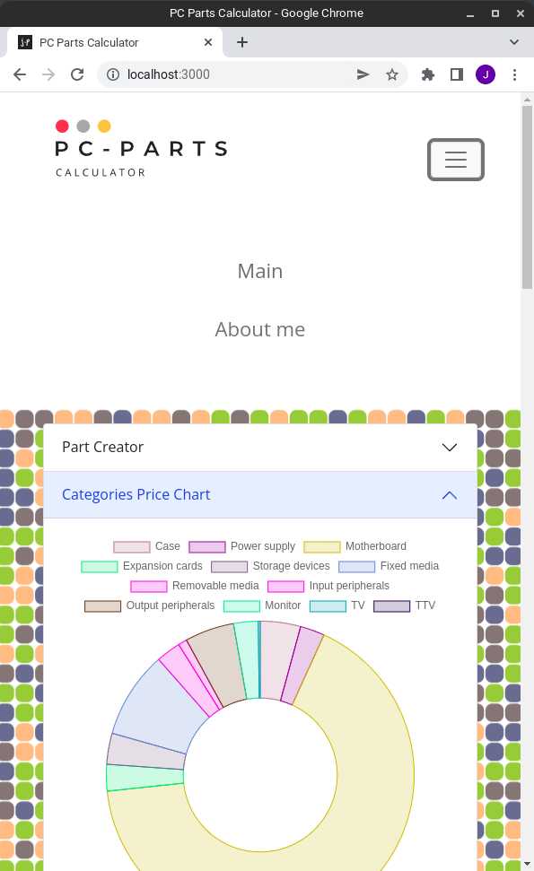
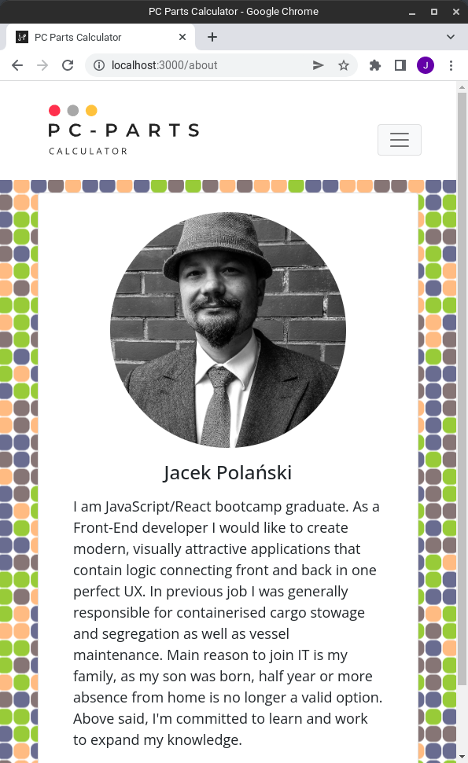

## Setup
- download or clone repository / `git clone repo_address`
- install dependencies / `npm install`
- start app by `npm start`

## Project Status
Project is: _no longer being worked on_. Assumed learning taks completed.

## Room for Improvement
- External endpoint
- Editing entered items
- Multi-select comparisons

## Contact
Created by [_jac.polanski_](https://www.linkedin.com/in/polanski-jacek/) - feel free to contact me!